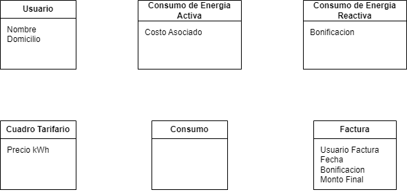
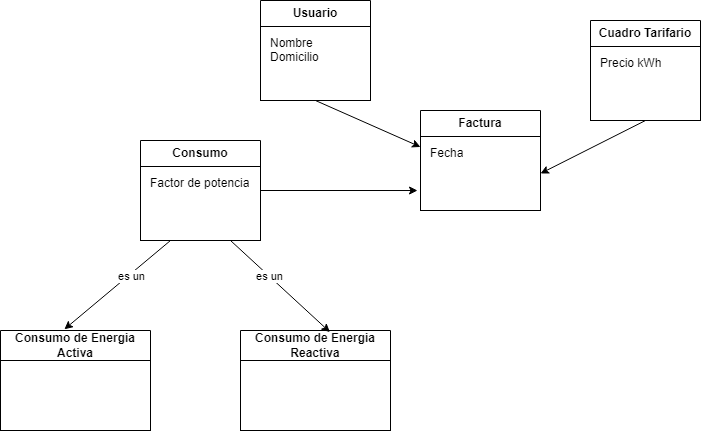

# Modelado del Dominino
## Ejercicio 15

### Conceptos Candidatos

* oo1.ej15.Usuario
* Nombre
* Domicilio
* Consumos
* oo1.ej15.Consumo de energia activa
* costo asociado
* oo1.ej15.Consumo de energia reactiva
* bonificacion
* Cuadro tarifario
* precio kWh (Ajustado Periodicamente)
* oo1.ej15.Factura
* fecha
* monto final de la factura
* usuario factura
* bonificacion
* costo del consumo
* factor de potencia

### Creacion de clases

    

### Asignacion de atributos a cada clase

    

### Asignacion de asociaciones

    

