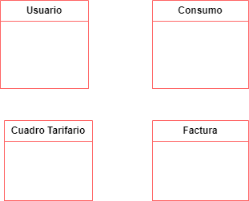
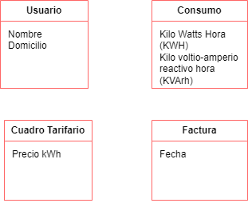

# Modelado del Dominino
## Ejercicio 15

### Conceptos Candidatos

* Usuario
* Nombre
* Domicilio
* Consumos
* Consumo de energia activa
* costo asociado
* Consumo de energia reactiva
* bonificacion
* Cuadro tarifario
* precio kWh (Ajustado Periodicamente)
* Factura
* fecha
* monto final de la factura
* usuario factura
* bonificacion
* costo del consumo
* factor de potencia

### Creacion de clases

    

### Asignacion de atributos a cada clase

    

### Asignacion de asociaciones

    

