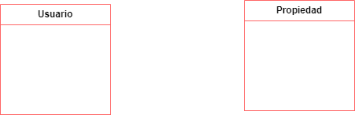
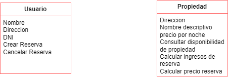
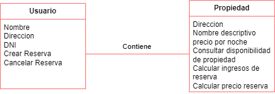

# Modelado de Dominio
## Ejercicio 17-18

### Conceptos candidatos

* Gestion de reservas(OOBnB)
* Gestionar inmuebles
* Realizar reservas
* Usuarios
* nombre
* direccion
* DNI
* Propiedades
* direccion
* nombre descriptivo
* precio por noche
* Reservas
* Consultar disponibilidad de una propiedad //propiedad
* Crear reserva //Usuario
* propiedad disponible
* Calcular precio de reserva (cantidad de noches * precio por noche) //Reserva
* Cancelar una reserva //usuario
* Calcular ingresos de una reserva //Propiedad
* retribucion al propietario
* 75% de suma
* Manejar periodos de reserva 

### Creacion de clases

    

### Asignacion de atributos a cada clase

    

### Asignacion de asociaciones

    

